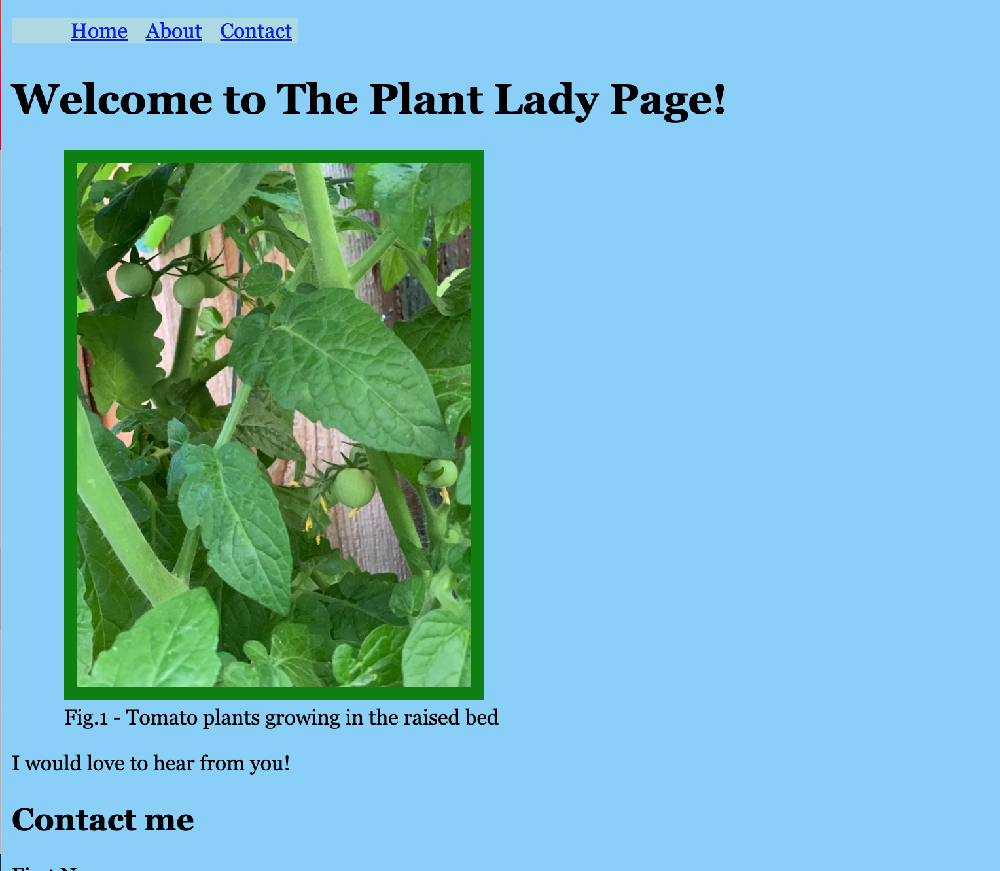
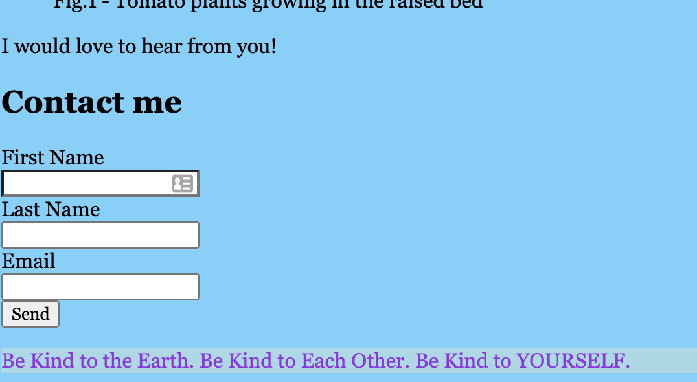

# Mini-Project-ClientLanding

I created this website for The Plant Lady to be a landing page and to provide contact information to The Plant Lady. She wanted semantic site with at least 3 colors, navigation that stays fixed to the top and also includes a quick jump to the contact info form, a header and footer, and to be posted live on GitHub. 

## Built With

* [HTML](https://developer.mozilla.org/en-US/docs/Web/HTML)
* [CSS](https://developer.mozilla.org/en-US/docs/Web/CSS)

## Deployed Link

* [Client Landing Page](https://lauragupta.github.io/Mini-Project-ClientLanding/)

## Features

This site has navigation that is fixed to the top of the page. 

The contact from the navigation also jumps right to the Contact form! 

## Author

* **Laura Gupta** 

- [Link to Github] https://lauragupta.github.io/prework-about-me/
- [Link to LinkedIn] https://www.linkedin.com/in/laura-gupta-5a277158/

## License

MIT License

Copyright (c) [2021] [Laura Gupta]

Permission is hereby granted, free of charge, to any person obtaining a copy
of this software and associated documentation files (the "Software"), to deal
in the Software without restriction, including without limitation the rights
to use, copy, modify, merge, publish, distribute, sublicense, and/or sell
copies of the Software, and to permit persons to whom the Software is
furnished to do so, subject to the following conditions:

The above copyright notice and this permission notice shall be included in all
copies or substantial portions of the Software.

THE SOFTWARE IS PROVIDED "AS IS", WITHOUT WARRANTY OF ANY KIND, EXPRESS OR
IMPLIED, INCLUDING BUT NOT LIMITED TO THE WARRANTIES OF MERCHANTABILITY,
FITNESS FOR A PARTICULAR PURPOSE AND NONINFRINGEMENT. IN NO EVENT SHALL THE
AUTHORS OR COPYRIGHT HOLDERS BE LIABLE FOR ANY CLAIM, DAMAGES OR OTHER
LIABILITY, WHETHER IN AN ACTION OF CONTRACT, TORT OR OTHERWISE, ARISING FROM,
OUT OF OR IN CONNECTION WITH THE SOFTWARE OR THE USE OR OTHER DEALINGS IN THE
SOFTWARE.

## Acknowledgments

* Thanks to Jerome Chenette for helping me to get my repo running and my live site made. 
